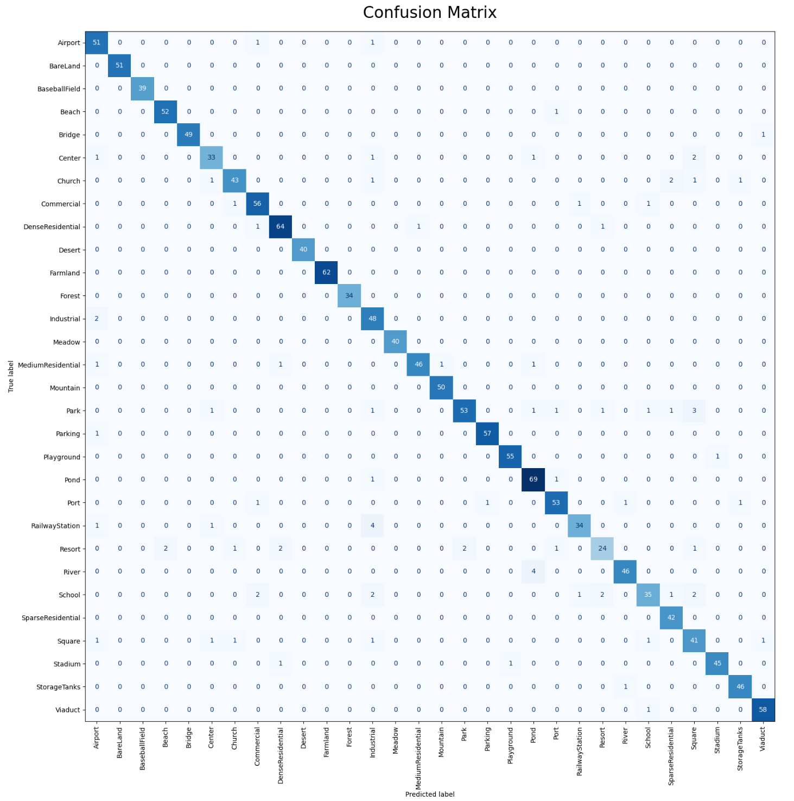
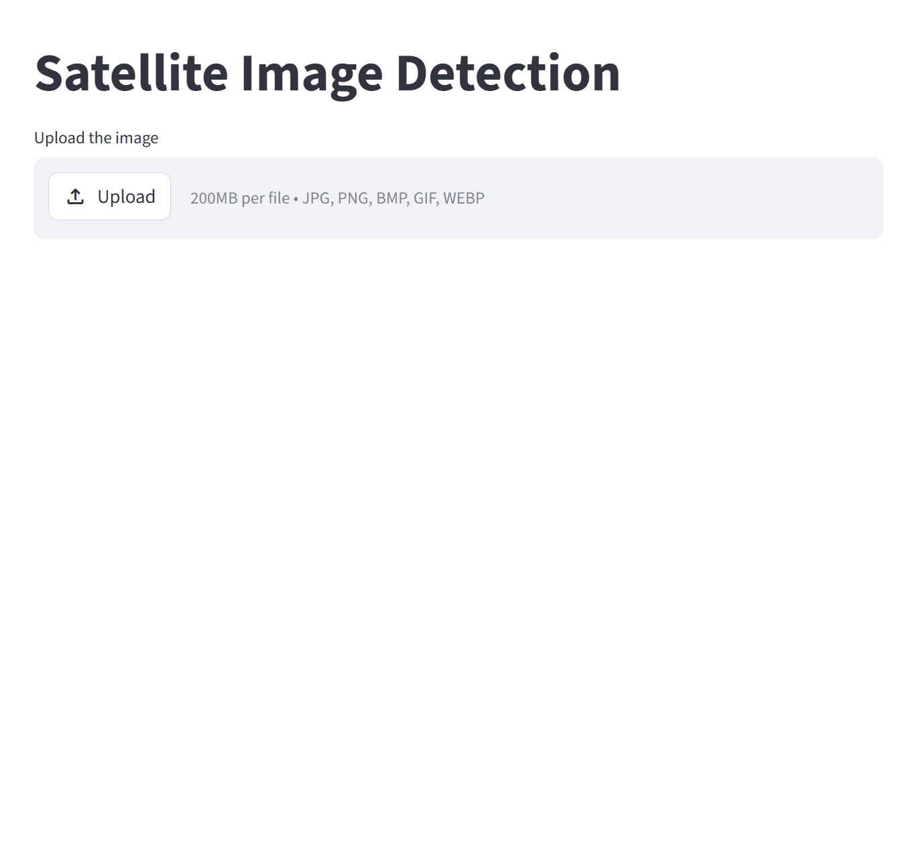
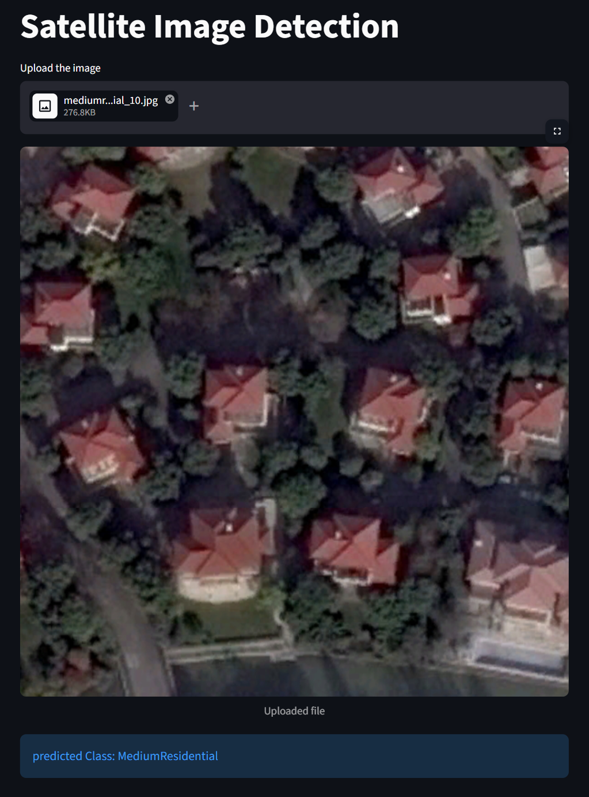
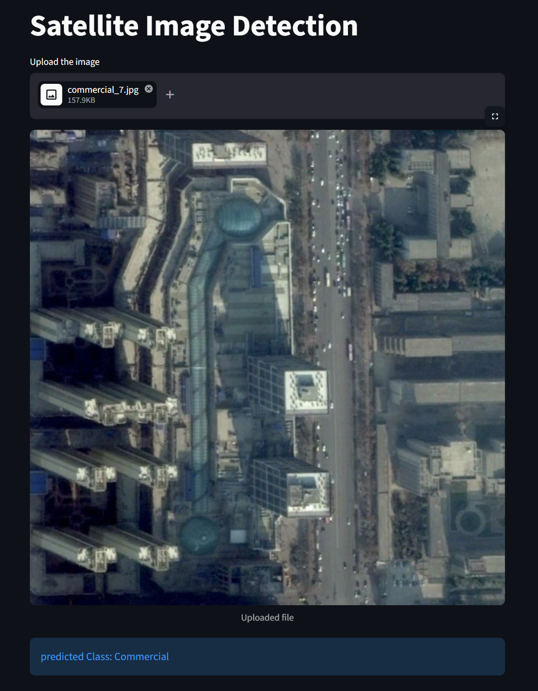

# 🛰️ Satellite Image Classification

A Deep Learning based **Satellite Image Classification Web Application** built using **PyTorch** and **Streamlit**.

This project classifies aerial and satellite scene images using the **AID (Aerial Image Dataset)** from **Kaggle** and predicts land-use categories through a trained CNN model.

---
## 🎥 Project Demo

[Watch Demo Video](https://www.youtube.com/watch?v=gU-zFAtHmuk)

---
# 📚 About AID Dataset

The **AID (Aerial Image Dataset)** is a large-scale dataset used for aerial scene classification.

### 📌 Dataset Information

* 🖼️ Total Images: **10,000+**
* 🏷️ Number of Classes: **30**
* 📏 Image Size: **600 × 600 pixels**
* 🌍 Dataset Type: Remote Sensing / Aerial Scene Classification

# 🏷️ AID Dataset Classes

<table>
  <tr>
    <td>✈️ Airport</td>
    <td>🏜️ BareLand</td>
    <td>⚾ BaseballField</td>
  </tr>
  
  <tr>
    <td>🏖️ Beach</td>
    <td>🌉 Bridge</td>
    <td>🏙️ Center</td>
  </tr>

  <tr>
    <td>⛪ Church</td>
    <td>🏢 Commercial</td>
    <td>🏠 DenseResidential</td>
  </tr>

  <tr>
    <td>🏜️ Desert</td>
    <td>🌾 Farmland</td>
    <td>🌲 Forest</td>
  </tr>

  <tr>
    <td>🏭 Industrial</td>
    <td>🌿 Meadow</td>
    <td>🏘️ MediumResidential</td>
  </tr>

  <tr>
    <td>⛰️ Mountain</td>
    <td>🌳 Park</td>
    <td>🅿️ Parking</td>
  </tr>

  <tr>
    <td>🛝 Playground</td>
    <td>🌊 Pond</td>
    <td>🚢 Port</td>
  </tr>

  <tr>
    <td>🚉 RailwayStation</td>
    <td>🏝️ Resort</td>
    <td>🌊 River</td>
  </tr>

  <tr>
    <td>🏫 School</td>
    <td>🏡 SparseResidential</td>
    <td>🏛️ Square</td>
  </tr>

  <tr>
    <td>🏟️ Stadium</td>
    <td>🛢️ StorageTanks</td>
    <td>🌉 Viaduct</td>
  </tr>
</table>

---

# 🎯 Model Performance

- ✅ Achieved **95%** classification accuracy on 30-class aerial scene dataset using transfer learning with ResNet18 and Optuna-based hyperparameter tuning.
- 🔥 Built using **Transfer Learning with ResNet18**
- 🧠 Pretrained model fine-tuned on the AID Dataset using PyTorch
- ⚡ Hyperparameter Optimization performed using **Optuna** for improved model performance and training efficiency

---

# 🚀 Features

- ✅ Upload aerial/satellite images
- ✅ Real-time scene classification
- ✅ Deep Learning powered predictions
- ✅ Streamlit interactive interface
- ✅ Lightweight deployment-ready application
- ✅ Multiple image format support

---

# 📂 Supported Image Formats

* JPG
* JPEG
* PNG
* BMP
* TIFF
* WEBP

---

# 🛠️ Tech Stack

| Technology      | Usage                       |
| --------------- | --------------------------- |
| Python 🐍       | Core Programming            |
| PyTorch 🔥      | Deep Learning               |
| Torchvision 🖼️ | Image Processing            |
| Streamlit 🎈    | Web Application             |
| Pillow 📷       | Image Handling              |
| NumPy 🔢        | Numerical Operations        |
| Optuna ⚡        | Hyperparameter Optimization |

---

# 📁 Project Structure

```text
Satellite-Image-Detection/
│
├── model/
│   └── model.pth
│
├── Screenshots/
│   ├── app_UI.png
│   ├── pred_1.png
│   ├── pred_2.png
│   └── confusion_Matrix.png
│
├── app.py
├── model_helper.py
├── requirements.txt
├── .gitignore
└── README.md
```

---

# ⚙️ Installation

## 1️⃣ Clone Repository

```bash
git clone https://github.com/YOUR_USERNAME/YOUR_REPO.git
```

## 2️⃣ Navigate to Project Folder

```bash
cd "Satellite Image Detection"
```

## 3️⃣ Install Dependencies

```bash
pip install -r requirements.txt
```

---

# ▶️ Run the Application

```bash
streamlit run app.py
```

The Streamlit application will launch in your browser.

---

# 📦 Requirements

```text
streamlit==1.57.0
pillow==12.2.0
torch==2.11.0
torchvision==0.26.0
numpy
```

---
<h1>🧠 Model Workflow</h1>

<p>
1️⃣ Upload aerial/satellite image <br>
2️⃣ Image preprocessing and transformation <br>
3️⃣ Transfer Learning based ResNet18 prediction <br>
4️⃣ Optimized inference using Optuna-tuned parameters <br>
5️⃣ Display predicted class label
</p>


# 📊 Confusion Matrix

<p align="left">
  
</p>

<!-- Example: screenshots/confusion_matrix.png -->

The confusion matrix visualizes the classification performance of the ResNet18 transfer learning model across different aerial scene categories.

---

# 📸 Application Preview

### 🖼️ Upload Satellite Image

Upload any aerial or satellite image for classification.

<p align="left">
  
</p>
### 🔍 Prediction Result

The application predicts the corresponding scene category instantly.

<table>
  <tr>
    <td></td>
    <td></td>
  </tr>
</table>
---

# 🌟 Future Improvements

- ✅ Add confidence scores  
- ✅ Improve model generalization  
- ✅ Add Grad-CAM visualization  
- ✅ Deploy on cloud platforms  
- ✅ Add dark mode UI  
- ✅ Multi-class probability graph

---

# ☁️ Deployment

This project can be deployed easily using:

* Streamlit Community Cloud
* Render
* Hugging Face Spaces

---

# 👨‍💻 Author

## Aashish Kumar Chetan

AI/ML Enthusiast 🚀

---

# 📜 License

This project is open-source and available under the **MIT License**.

---

# ⭐ Support

If you like this project, give it a ⭐ on GitHub!
